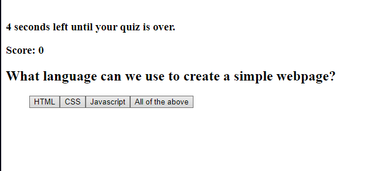
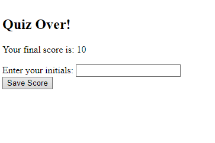

## User Story ##
As a user I want to be able to test my knowledge on coding, specifically I want to check my knowledge on Javascript. I am looking for a site to offer a high quality quiz that gives me a score times me. I want to then be able to add my score to a leaderboard to try and beat my previous score.

## The project its self ##
The project is compised of 3 parts, the screen the user loads into containing a welcome message and a start button, the quiz its self containing a quiz with multiple choice questions, a score and a timer that decreases every second by default but can be increased when the user answers a question correctly and dramatically decreases when they answer a question incorrectly. Finally the page has an end screen that stores their score and initals. 

## How it works ## 
When the start button is clicked the timer starts, and the score appears, it is initally set to 0. A question will pop up with appened buttons that store the choices for each question. When a user presses the choice button if it is correct score and time are increased, if the answer is wrong the score and time DECREASE. The question is then cycled to the next question. If the time runs out, the end screen appears and the user will not be able to answer questions.

## Links and Screenshots to/of the deployed application ##
Repository link: https://github.com/kiedae/quizgame

Deployed page link: https://kiedae.github.io/quizgame/

